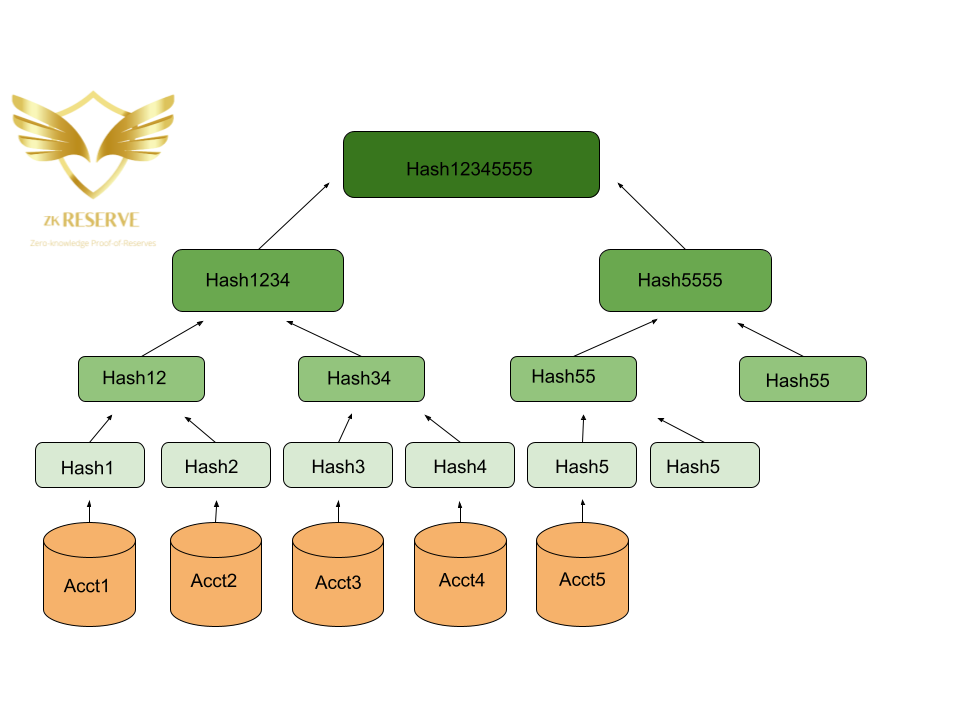

# zkReserves
A on-chain Bitcoin Proof-of-Reserves platform on the Bitcoin blockchain. 

<!-- image -->
<p align="center">
  
</p>

<b> Abstract </b> </br>
Central exchanges and lenders need decentralized control. zkReserves is a distrbuted system using zk verification to prove the reserve holdings from the largest to smallest exchanges in the world. The CEX hack era began roughly around 2011 where projects from Mt. Gox, Bitcoin7, Bitfloor, BitMarket.eu and more imploded. Even till this day, FTX and Celsius has brought users to a halt with retracement to fundamentals such as owning private keys and DYOR on not just alt-coins but platforms and applications. Contagion creates a domino effect that impacts the entire industry during periods of low liquidity (bear markets/crashes). zkReserves helps navigate who is real and who is fake.

<b> Hack History </b> </br>


Sneak peek of sCrypt code here :star: :
```
static function equal(bytes msg) : bool {
    asm {
        "zkReserves saves the industry! 😊"
        OP_EQUAL
    }
}
```


## Inspiration
Centralized programs and platforms create a threat landscape to the ownership and liquidity of user's funds. FTX is an example of CEX gone wrong, users funds used as colateral, financial perversion,lies, cover ups, this is what happens when users opt in to custodial projects. An on-chain Proof-of-Reserves framework leveraging zk-technology can ensure proof of token holdings of centralized exchanges. zkReserves is a self-regulatory platform powered by the Bitcoin blockchain to implement threat migitation prior to users begging for big brother (SEC, OFAC, or other gov entities) to help them recover funds. Help from regulators is not always promised; if this industry aims to be decentalized then decentralized self-auditing is primal for user protection.

## What it does
Tracks the reserves on the <b> crypto exchanges </b>: 
- Binance
- Crypto.com
- BitMex
- OKX
- Huobi
- Bitfinex
- Bybit
- Kucoin
- Deribit
- Kraken
- etc.

Reserves are the assets held by exhcnages on behalf of its users. In the typical PoR framwork a third-party has to conduct the audit but in this case zkReserves acts as a zero knowledge platoform that cuts out the third parties and puts code back in the distributed pipeline. Third-parties are the antithesis of this space.

## How we built it
Using scrypt we launched our smart contracts on-chain. We used primarily Javascript and Python for the code stack. Javacript used in the UI development; Python for computation.

## Challenges we ran into
This was the first time using sCrypt. Going through the docs while ideating can be time consuming but the feat was won by way of sleep and coffee. Another challenge is that exchanges could borrow funds on a short-term basis to manipulate the snapshot of their reserves in real-time. To front-run this manipulation we used the merkle tree proofs framework to prevent chicanery.

## Accomplishments that we're proud of
Launching smart contracts on Bitcoin! Definitely will be one of many Bitcoin and non-EVM compatible projects.

## What we learned
sCrypt allows for AI/ML integration for both computer vision and natural language processing which is why there is a deep learning component to zkReserves.

## What's next for zkReserve Lite
Transferring from sCrypt smart contracts to Clarity by Stacks may be another avenue for Bitcoin blockchain exposure thanks to Taproot upgrade.
